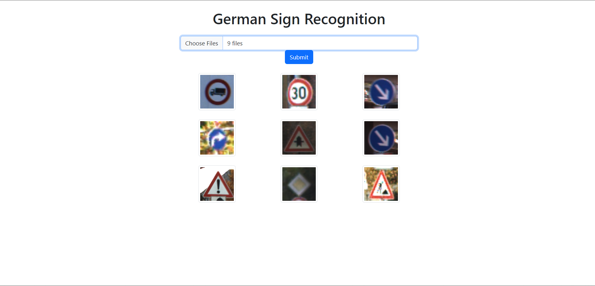
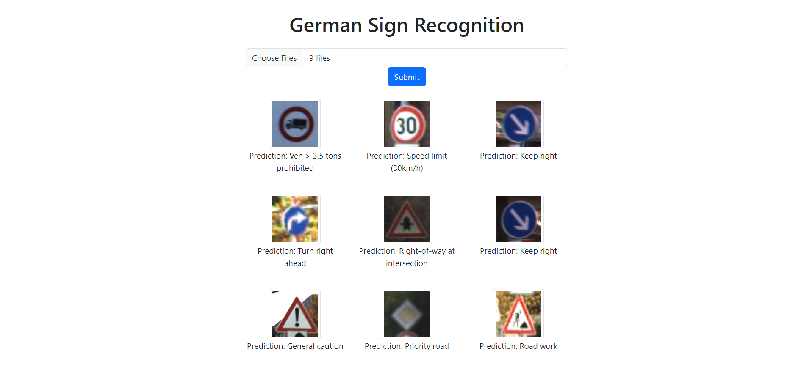

# GTSRB TRAFFIC SIGN CNN

Convolutional Neural Network model for German Traffic Sign Recognition Benchmark \(GTSRB\) dataset

## Table of Contents

- [Installation](#installation)
- [Usage](#usage)
- [References](#references)
- [License](#license)

## Installation
Install python version 3.10.13 or above to run model and backend
Install necessary machine learning libraries \(Tensorflow, SKlearn, OpenCV, Keras, Numpy, Pandas\)
install node v20.11.0 or above to run frontend

## Usage

### To run model
go to `cd ./model` and run the `python model.py`

make sure to download the [GTSRB](https://www.kaggle.com/datasets/meowmeowmeowmeowmeow/gtsrb-german-traffic-sign/) dataset and add it under `/models/dataset`

### To run Backend
go to `cd ./backend/src` and run `python app.py`

sent the image to /predict route as POST method and in form with name "image"

### To run Frontend
go to `cd ./frontend/traffic-sign-recognition`
run `npm install`
then run `npm start`

## References

GTSRB - https://www.kaggle.com/datasets/meowmeowmeowmeowmeow/gtsrb-german-traffic-sign/

Model code reference - https://www.kaggle.com/code/suryarajendhran/starter-gtsrb-german-traffic-sign-4f9b7b92-1

## License

This project is licensed under the [MIT License](https://opensource.org/licenses/MIT).

You are free to use this code for open source projects, but it is not intended for use in closed source corporate projects. There is no guarantee or warranty provided with this code.
